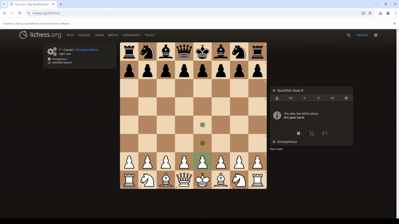

# Selenium Lichess Bot

> [!WARNING]  
> This is not designed to be used for online play. Using this online will result in a permanent ban to your Lichess account.



## Overview
Selenium Lichess Bot is a Python-based project designed to interface with [Lichess](https://lichess.org/). It has been designed to work with Chrome and only supports Windows.

It includes functionality to detect where pieces are on the board, calculate the best move, inject JavaScript to display the best move, and automatically interact with Lichess to play the best move.

## Features
- **Board Analysis**:  
  Evaluate board states using object detection through HTML and show the best move.
  
- **Automatically Move**:  
  Uses Selenium to automate the movement of pieces.

- **Script Generation**:  
  Generate JavaScript scripts to overlay arrows indicating the best move.

## Quick Start with `.exe`
> [!IMPORTANT] 
> **Note**: The `.exe` file assumes the Stockfish binary is present in the `stockfish` folder in the same directory as the `.exe`. Ensure the Stockfish binary is downloaded and correctly placed.

For a quick and easy setup, download and run the prebuilt `.exe` file:

1. Go to the [Releases](https://github.com/leele2/Selenium-Lichess-Bot/releases) page.
2. Download the latest `run.exe` file.
3. Place the downloaded file in a folder of your choice.
4. Double-click the `run.exe` file to launch the bot.

## Installation (For Developers)
### Prerequisites
- Python 3.8 or later
- `pip` (Python package installer)

### Dependencies
Install the required Python libraries using:
```bash
pip install -r requirements.txt
```
Requires the Stockfish binary to be placed inside the `stockfish` folder.

### Setup
1. Clone this repository:
   ```bash
   git clone https://github.com/leele2/Selenium-Lichess-Bot
   cd Selenium-Lichess-Bot
   ```
2. Ensure your environment is set up with the required dependencies.

3. [Download](https://github.com/official-stockfish/Stockfish/releases/latest) and extract the Stockfish binaries (.exe) to the `stockfish` folder.

4. Run the bot:
   ```bash
   python main.py
   ```

## Configuration
Upon the first run, a `config.ini` file will be generated with default values. You can edit this file to customize the bot's behavior:

- **thinking_time**: `float`  
  Maximum time allowed for the engine to calculate the best move.

- **time_before_move**: `float`  
  Delay between detecting a move and calculating the board positions. If this is too low, the bot will calculate the best move based on the previous position.

- **time_after_move**: `float`  
  Delay after a move has been played. If this is too low, the bot still thinks it's their turn and will premove.

- **UCI_Elo**: `int [min 1320 max 3190]`  
  Stockfish aims for an engine strength of the given Elo. [Learn more](https://official-stockfish.github.io/docs/stockfish-wiki/UCI-&-Commands.html).

- **automove**: `Bool [True/False]`  
  If set to `False`, the best move will no longer be automatically played.

- **chrome_dir**: `str`  
  By default, this is empty. Change it to the directory of your Chrome profile if you wish to use it.

## Usage
1. Run the bot:  
   - **Using the `.exe`**: Double-click `run.exe`.  
   - **Using the Python script**:  
     ```bash
     python main.py
     ```
2. The browser will automatically navigate to Lichess. Start a game, and the bot will begin working after White has placed their first move.

## Contributing
Contributions are welcome! To contribute:

1. Fork the repository.
2. Create a new branch for your feature or bug fix:
   ```bash
   git checkout -b feature-name
   ```
3. Commit your changes:
   ```bash
   git commit -m "Add new feature"
   ```
4. Push the changes and create a pull request.

## License
This project is licensed under the MIT License. See the [LICENSE](LICENSE) file for details.

## Future Improvements
- Add a graphical user interface (GUI) to adjust config values live.
- Add support to detect if castling rights exist.
- Add support for non-queen promotions.
- Find a faster accurate method to detect if a move has been played.